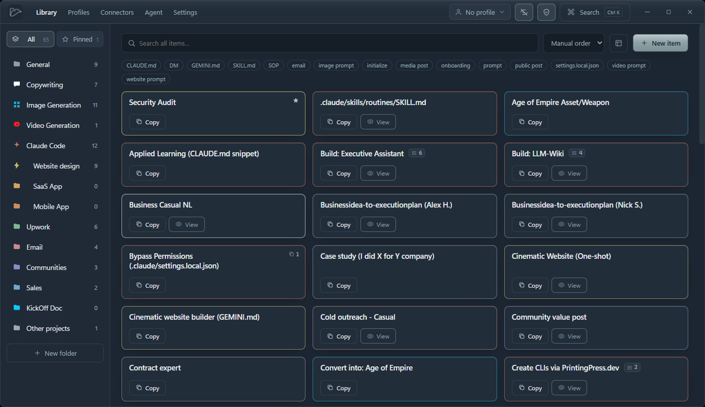
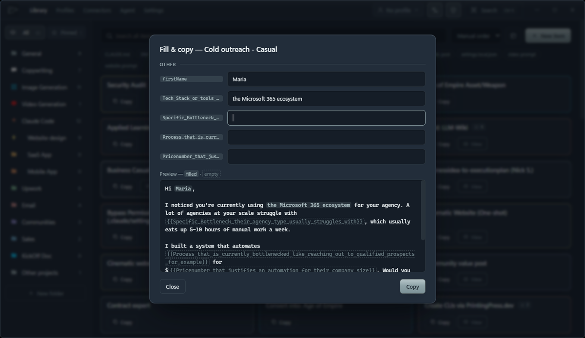
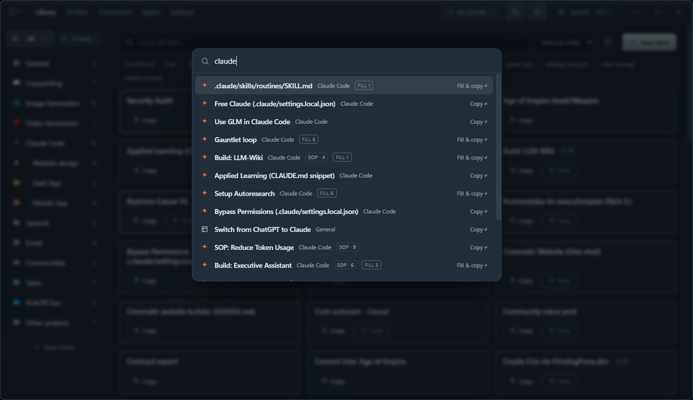
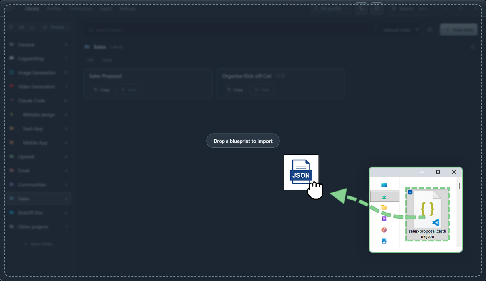
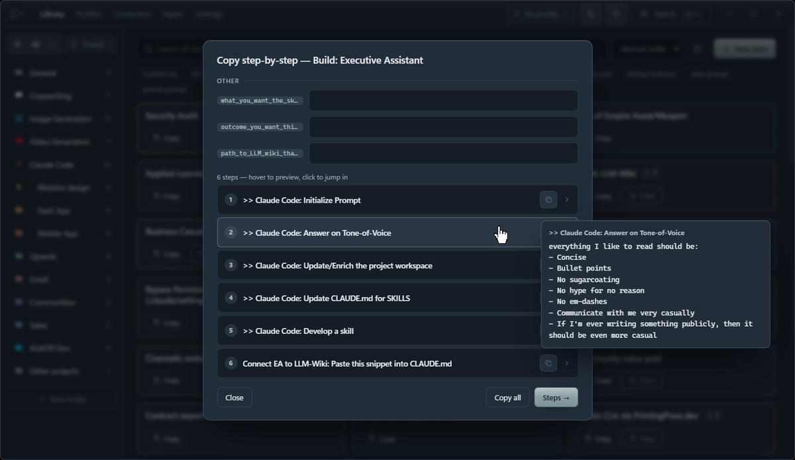

<div align="center">

# Castline

**A local template library for any text you reuse frequently: AI prompts, email templates, notes and multi-step SOPs.**

Cast any block of text once, fill it in a second, paste it anywhere.

[](https://github.com/Ramonvdo/castline/releases)
[](https://tauri.app)
[](LICENSE)
[](https://github.com/Ramonvdo/castline/releases/latest)



</div>

---

<div align="center">

### Fill it from a profile, copy in one click



</div>

<table>
<tr>
<td width="50%">

**Ctrl+K. Type. Copied.**



</td>
<td width="50%">

**Share templates as blueprints**



</td>
</tr>
<tr>
<td width="50%">

**Step through multi-step SOPs**



</td>
<td width="50%">

**Everything stays yours**

Plain JSON in your own app-data folder. No account, no cloud, no telemetry — and
the source is right here to check.

</td>
</tr>
</table>

---

## What it is

Castline is a fast desktop shelf for **any reusable text** — AI prompts, `CLAUDE.md`-style notes,
message and email templates, and multi-step SOPs. Everything is copy-pasteable text at the end of the
day, so there's no artificial split between "prompts" and "templates": one unified item, with folders,
tags, colours and icons to keep a big library tidy.

It's **local-first** (plain JSON files on your machine — no account, no cloud, no telemetry) and
**tiny** (a Tauri + Rust binary, single-digit-MB installer).

## Features

- **`{{variables}}` + Fill & copy** — write `Hi {{firstName}}, …` once; fill the blanks and copy in one step.
- **Profiles** — save named sets of variable values (a client, a project, yourself) and auto-load them
  when filling. Stored in a **separate file** from your library, so prompts and people back up independently.
- **SOPs (multi-step)** — chain prompts into an ordered runbook: the preview opens on an **overview**
  of all steps (hover a title to peek at its filled message), then copy them step-by-step.
- **Email items** — an item type with a separate **subject** line ({{variables}} allowed) that webhook
  payloads map independently from the body, so a Make/n8n automation can send the email directly.
- **Pick & combine** — `Ctrl`-click any cards to select them in order (each shows its number), then
  **Copy combined**, spin them into a **New SOP**, or **export to `.md`** — perfect for assembling a
  custom SOP to hand a client.
- **Quick find (`Ctrl`+`K`)** — fuzzy-search every item across all folders and copy instantly.
- **Beat the mess** — global search, cross-folder tag filters, folder icons/colours, an "All items"
  view and Favourites keep large libraries scannable.
- **Import / export** — your library and profiles are portable JSON. Back them up, share them, open the
  folder, or edit by hand.
- **Connectors (Make / n8n)** — paste a webhook URL and Castline POSTs a profile's fields to it, then
  builds/enriches the profile from the JSON your scenario returns. No tunnel, no open port (see below).
  Also: **Send all profiles** in one payload, send any library item to a webhook from its right-click
  menu, and **schedule** recurring sends (daily/weekly/monthly) in Settings.
- **Inbound HTTP endpoints** — flip it around: enable a token-gated local endpoint and paste its exact
  config into a Make **HTTP** module (or n8n **HTTP Request** node) to **Create** or **Update/enrich**
  a profile from the outside.
- **Castline AI enrich** — one OpenRouter call fills a profile's variables from what's already known
  (optionally with live web research). Guided by per-variable **descriptions** you write in Settings.
- **AI agent** — an embedded terminal running your own `claude` CLI in the data folder, with a generated
  `CLAUDE.md`, so it can research contacts and create/enrich profiles for you (via the local endpoint).
- **Date tokens** — `{{today}}` and `{{now}}` fill themselves at copy time, with Make-style formats:
  `{{today:YYYY-MM-DD}}`, `{{now:HH:mm}}`, `{{today:MMM D, YYYY}}`.
- **Usage counts** — every card shows how often you've copied it; sort any view by **Most used**.
- **Starts with Windows & lives in the tray** — autostart is on by default (toggle in Settings);
  closing the window keeps Castline running in the system tray, so schedules, the HTTP endpoint and
  the agent stay available. Reopen from the tray icon; **Quit** is in its right-click menu.
- **Safe mode** (shield toggle, on by default) — nothing with unfilled `{{variables}}` can be sent to
  an external webhook; Castline asks you to fill first. Pair it with **lock-empty variables** (padlock
  in the profile editor): a locked variable is always empty, must be typed on the spot, and no enrich
  path (AI, webhook, inbound API) can ever write it — perfect for personal notes that must stay human.
- **AI fill in the preview** — one click fills only the *empty* variables using the current template as
  context; nothing is saved to the profile — made for one-off copies and sends. SOP previews also get a
  per-step **copy** and **send-to-webhook** button right on the overview rows.

## Install

### Prebuilt (recommended)
Download the latest installer from the [**Releases**](https://github.com/Ramonvdo/castline/releases/latest) page:

- **Windows** — `Castline_x.y.z_x64-setup.exe` (NSIS, installs for the current user)
- **macOS** — `Castline_x.y.z_universal.dmg`

### "Windows protected your PC" / "unidentified developer"

These builds aren't code-signed, so the OS asks once before running them. Nothing is wrong with
the download — a signing certificate costs a few hundred euro a year, which a free MIT app doesn't
carry yet.

- **Windows** — click **More info → Run anyway**.
- **macOS** — **right-click the app → Open**, then confirm.

Every release also ships `SHA256SUMS.txt`, so you can verify a download is byte-for-byte what CI
built:

```powershell
Get-FileHash .\Castline_x.y.z_x64-setup.exe -Algorithm SHA256   # Windows
shasum -a 256 Castline_x.y.z_universal.dmg                      # macOS
```

### Build from source
Requires [Rust](https://www.rust-lang.org/tools/install), [Node 18+](https://nodejs.org), and the Tauri CLI.

```bash
git clone https://github.com/Ramonvdo/castline.git
cd castline
npm install
npm run tauri dev      # run in development
npm run tauri build    # produce an installer in src-tauri/target/release/bundle
```

## Where your data lives

Two portable JSON files (plus settings) in your OS app-data folder — reachable from
**Settings → Data & backups → Open folder**:

| File | Contents |
| --- | --- |
| `library.json` | folders, prompts, templates, notes, SOPs |
| `profiles.json` | `{{variable}}` value sets (+ global variable grouping) |
| `settings.json` | outbound connector URLs, HTTP-endpoint + AI-agent config |
| `CLAUDE.md` / `MEMORY.md` | agent context (generated) + the agent's durable notes |
| `history.json` | the Recent-sends log (last 50 webhook sends with payload previews) |

- **Windows:** `%APPDATA%\Castline\`
- **macOS:** `~/Library/Application Support/Castline/`

## Blueprints → share templates with anyone

A **blueprint** is a small `.json` file describing one or more templates — the same idea as a
Make.com / n8n scenario blueprint. Export one, send it to someone, and they drop it into their
Castline. No account, no server, nothing to sign up for.

**Export**

| Where | What you get |
| --- | --- |
| Right-click a template → **Export blueprint** | that one template as `<name>.castline.json` |
| Right-click a template → **Copy as blueprint** | the same JSON on your clipboard — paste it straight into Slack/Discord/email |
| Select several (Ctrl/Cmd-click) → **Export blueprints** | one file holding the whole selection |
| Right-click a folder → **Export folder blueprint** | every template in it, plus the folder's name, icon and colour |

**Import** — any of these opens a preview showing what's inside, which `{{variables}}` it expects, and
a folder to drop it into. Nothing is written until you press Import:

- **Drag the `.json` file anywhere onto the window**
- The **import button** in the toolbar → *From file…*
- The same button → *From clipboard* (for a blueprint someone pasted you)

Imported templates always arrive as **copies** with fresh ids, so they can never overwrite something
you already have. A blueprint carries only what's shareable — names, text, steps, tags. Your ids,
copy counts, pins and timestamps stay on your machine and are never written into the file.

```json
{
  "castline_blueprint": 1,
  "exported_at": "2026-07-24T14:22:01",
  "app_version": "1.1.3",
  "folder": { "name": "Sales", "icon": "mail", "color": "#6fa8c9" },
  "items": [
    {
      "name": "Cold outreach",
      "kind": "template",
      "type": "email",
      "subject": "Quick idea for {{companyName}}",
      "text": "Hey {{firstName}}, …",
      "steps": [],
      "tags": ["sales"]
    }
  ],
  "variables": ["companyName", "firstName"]
}
```

## Connectors → enrich & create profiles (Make / n8n)

Rather than run a server you'd have to expose to the internet, Castline calls **out** to a webhook URL
you paste from Make / n8n (or any HTTP endpoint). It POSTs a profile's fields and reads the JSON your
scenario returns — a single request/response round-trip on the connection Castline opens, so there's
**no tunnel and no open port**.

1. In Make add a **Custom webhook** trigger (n8n: a **Webhook** node) and copy its URL.
2. Add your lookup/enrichment steps, then a **Webhook response** module (n8n: **Respond to Webhook**)
   that returns JSON.
3. In Castline → **Connectors**, paste the URL. **Test** shows exactly which fields Castline sends
   (all your `{{variables}}`) so you can map them in Make/n8n, and shows what comes back.
4. Use it from **Profiles**: **Enrich** a profile (send its fields, merge the returned ones) or **New
   from connector** (send a seed like an email, build a profile from the response).

Response keys become variables of the same name — all mapping lives in your Make/n8n scenario, so
changing fields never means reconfiguring Castline. No integration? **Paste JSON…** in Profiles still
works.

**Outbound extras:** the Profiles header has **Send all ▾** (POSTs `{ "profiles": [ { name, values } ] }`
to a connector in one click), and any library item has a **plug button** (and right-click entry) to send
it to a connector. Item payloads carry every useful shape at once — `subject` (mapped separately for
emails), `text` (the whole message, SOP steps stacked), `text_pages` (the same separated by `---`,
markdown page breaks) and `steps[]` — plus the active profile's `variables`, so e.g. `{{email}}` can
drive the automation. **Ctrl-select** several items and the selection bar's **Send ▾** posts one JSON
with `items[]` (each individually), `combined`, and `combined_pages`. **Settings → Scheduled jobs**
automates sends on a daily/weekly/monthly cadence: all profiles, one item, a whole folder — or a local
**backup** of your data files. Schedules run while Castline is open (the tray keeps it open); **missed
runs are skipped** and the cadence re-anchors at launch, unless a job opts into *Catch up*, which fires
it exactly once.

## Castline AI enrich (OpenRouter)

Each profile's **Enrich ▾** menu offers three routes: **Castline AI** (structured, one call), any
**webhook connector** (your Make/n8n scenario), or **Ask the Agent** (open-ended, in the terminal).

For Castline AI, add an [OpenRouter](https://openrouter.ai/keys) API key in **Settings → AI workflow**
and pick a model. Choosing **Castline AI** opens a small dialog: add **extra context** (notes from a
call, a LinkedIn blurb), **attach a `.txt`/`.md` file**, and tick any of three opt-ins for that run —
**Web research** (OpenRouter's `:online` mode, works with *any* model), **Tone of voice**, and **Use
library as reference** (the templates where your variables live, so generated text fits the sentence
around it). With nothing ticked the generation stays simple: just the profile's values plus the
**variable descriptions** you write in **Settings → Variables** — e.g. describing `{{companyName}}` as
*"simplified lowercase company name: 'RocketFarm Studios LLC' → 'rocketfarm'"* makes every enrichment
come back in exactly that shape. The same descriptions are baked into the agent's `CLAUDE.md`.

**Tone of voice:** Settings arrives prefilled with a starter tone (casual, charismatic, straight to the
point, never em dashes) so setup is fast — it's plain text you can edit or clear (empty = no tone at
all), and a profile can override it with its own tone (e.g. "formal, in Dutch") in the profile editor.
It only applies when the enrich dialog's checkbox is ticked.

**Profile-aware everywhere:** with a profile selected in the top bar, card **Copy**/**send** buttons get
an accent border (variables are filled), **Fill & copy** becomes **Preview** — filled variables glow
accent, empty ones show dashed — and both the preview and per-item webhook sends carry the **filled**
text plus the profile's values (so `{{email}}` etc. are usable by your automation).

## Inbound HTTP endpoints → push profiles in (Make / n8n HTTP module)

The reverse direction. In **Connectors → HTTP endpoint (inbound)**, flip it on to get a token and two
copy-paste-ready actions to drop into a Make **HTTP** module (n8n **HTTP Request** node):

| | Create profile | Update / enrich profile |
| --- | --- | --- |
| Method | `POST` | `POST` |
| URL | `http://127.0.0.1:8787/api/create-profile` | `http://127.0.0.1:8787/api/update-profile` |
| Headers | `Authorization: Bearer <token>` · `Content-Type: application/json` | same |
| Body | JSON — every key becomes a variable | JSON with a `name` **or** `email` to match, plus the fields to merge |

Create makes a brand-new profile; Update merges into the profile matched by `name` (case-insensitive) or
`email` (`404` if none match). The UI's **Test locally** button fires each action so you can see it work.

The endpoint binds `127.0.0.1`, is **off by default**, and is gated by a random 256-bit bearer token
(regenerate it any time in the Connectors tab). It rejects browser cross-site requests and throttles
repeated bad tokens. The **supported** setup is a **self-hosted n8n** on the same machine/LAN, which
reaches it directly.

> ⚠️ **Exposing it to the internet is at your own risk.** A tunnel (ngrok / Cloudflare Tunnel) *can*
> let **Make cloud** (or any internet scenario) reach `127.0.0.1:8787`, but then a small loopback
> server on your PC accepts writes from the public internet, guarded only by the token. If you do this,
> keep the endpoint on only while you need it and rotate the token afterwards. For always-on internet
> automation, the hosted **Castline Cloud** API (coming) is the safer path — a real server with proper
> auth, so nothing on your machine is exposed.

## AI agent → research & enrich profiles

The **Agent** tab embeds your own **Claude Code** CLI (`claude`) in a real terminal, launched in
Castline's data folder. The app generates a `CLAUDE.md` there describing your `library.json` /
`profiles.json` and the local write endpoint, so the agent can read your data, research contacts with
whatever tools you've given it, and **create or enrich profiles** by POSTing to the endpoint above (Rust
stays the only writer, so the JSON never gets corrupted and the UI updates live). Durable notes it keeps
go in `MEMORY.md`, which Castline never overwrites.

Requires Claude Code installed (`npm install -g @anthropic-ai/claude-code`, or from **claude.ai/code**).
Starting the Agent turns the HTTP endpoint on automatically so the agent has a write path.

## Cutting a release

Version lives in three files — keep them in sync, then tag:

1. `package.json` → `version`
2. `src-tauri/Cargo.toml` → `version`
3. `src-tauri/tauri.conf.json` → `version`

```bash
git commit -am "release: v1.0.1"
git tag v1.0.1
git push origin v1.0.1
```

The tag triggers `.github/workflows/release.yml`, which builds Windows + universal-macOS installers and
attaches them to a **draft** GitHub Release for you to review and publish.

## Project structure

```
castline/
  src/                 Svelte 5 frontend (Library, QuickOpen, FillCopy, Profiles, Settings, Icon)
  src-tauri/src/
    library.rs         folders + items store (library.json)
    profiles.rs        variable profiles store (profiles.json)
    settings.rs        app settings (connectors, HTTP endpoint, AI, schedules)
    connectors.rs      outbound POST (ureq) + JSON→profile passthrough
    receiver.rs        inbound HTTP endpoint (tiny_http): create / update profile
    llm.rs             Castline AI enrich (OpenRouter chat completions)
    scheduler.rs       recurring webhook sends (60s ticker)
    ai.rs              embedded claude PTY (portable-pty) + reader/emitter threads
    agent.rs           generates the agent's CLAUDE.md / MEMORY.md
    lib.rs             Tauri commands + app setup + store file-watcher
```

## Tech stack

Tauri v2 · Rust · Svelte 5 + Vite · plain JSON storage · `ureq` (outbound) + `tiny_http` (inbound) ·
`portable-pty` + `xterm.js` for the embedded agent.

## Support the project

Castline is free and MIT-licensed, and stays that way. If it saves you time and you'd like to chip
in, you can [**sponsor the project**](https://github.com/sponsors/Ramonvdo) — entirely optional, and
nothing in the app is ever gated behind it.

## License

[MIT](LICENSE) © Castline contributors
