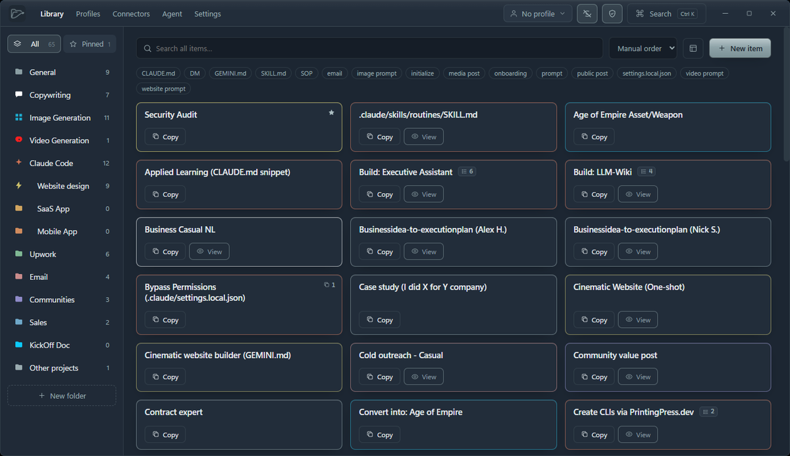
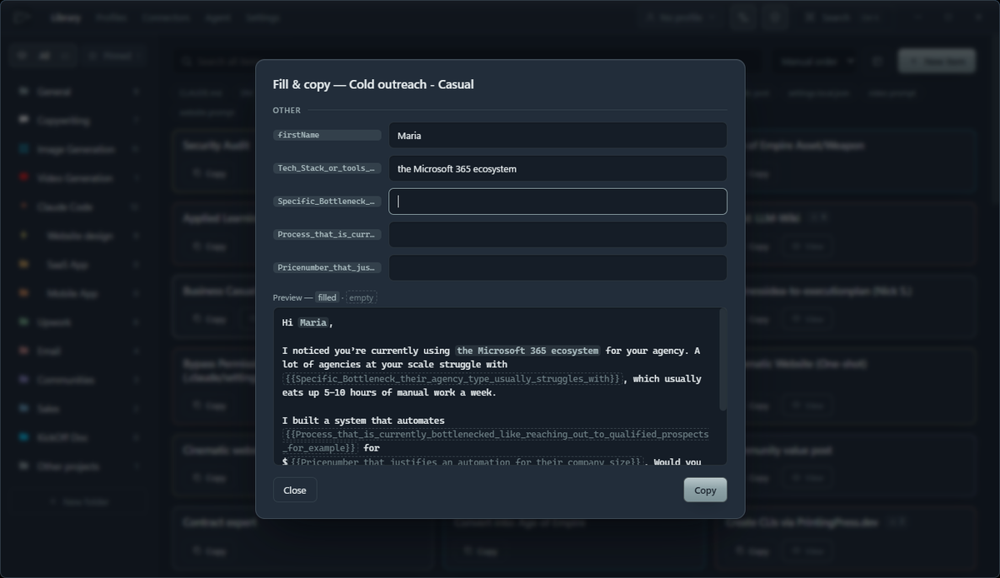
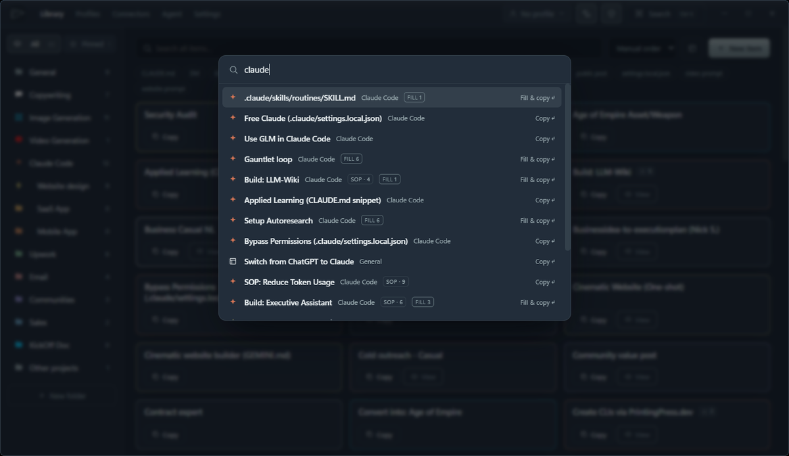
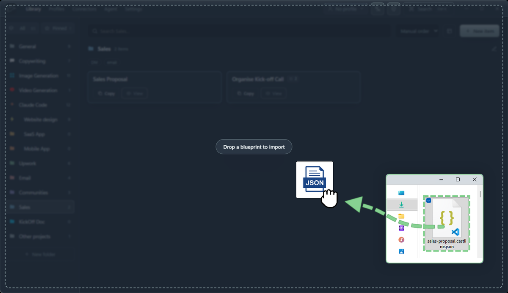
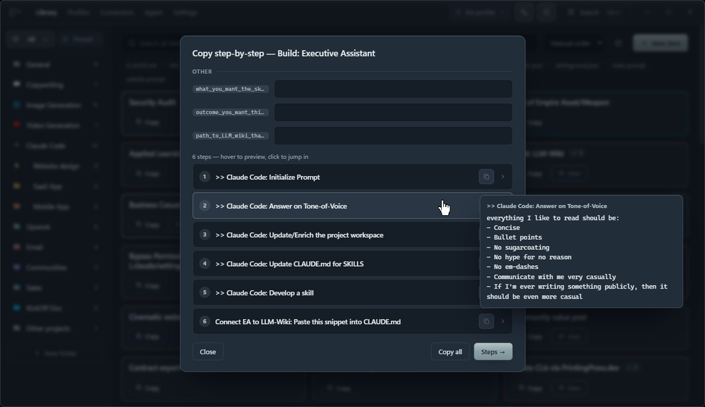

<div align="center">

# Castline

**Stop retyping the same text.**

Keep the prompts, emails, notes and checklists you reuse in one place. Fill the blanks from a saved
profile, copy, paste. Everything lives as plain JSON on your own machine.

[](https://github.com/Ramonvdo/castline/releases)
[](https://tauri.app)
[](LICENSE)
[](https://github.com/Ramonvdo/castline/releases/latest)

[**Get it from the Microsoft Store**](https://apps.microsoft.com/detail/9NVJX06SSMTH) · [Direct download](https://github.com/Ramonvdo/castline/releases/latest) · [castline.dev](https://castline.dev)



</div>

---

## Why it exists

You already have the good version of that email, that prompt, that onboarding checklist. It is
buried in a doc, a Slack thread, or last month's chat history. So you write it again, slightly
worse, and lose ten minutes.

Castline is a shelf for text you know you will need again. Write it once with `{{variables}}` where
the details change, save a profile per client or project, and every future copy takes a second.

It is a small Tauri and Rust app, a single-digit-MB installer, with no account and no cloud.

<div align="center">

**Fill it from a profile, copy in one click**



</div>

<table>
<tr>
<td width="50%">

**Ctrl+K, type, copied**



</td>
<td width="50%">

**Share a template as a file**



</td>
</tr>
<tr>
<td width="50%">

**Step through a process**



</td>
<td width="50%">

**Your data stays yours**

Plain JSON in your own app-data folder. No account, no cloud, no telemetry, and the source is right
here to read.

</td>
</tr>
</table>

## What you get

### Write once, fill in a second

Put `{{variables}}` anywhere in an item, then save a profile (a client, a project, yourself) that
holds the values. Pick a profile in the top bar and every copy comes out filled. Profiles live in a
separate file from your library, so your text and your contacts back up independently.

`{{today}}` and `{{now}}` fill themselves at copy time, with Make-style formats like
`{{today:MMM D, YYYY}}` or `{{now:HH:mm}}`.

For a one-off where you do not want to save anything, the preview has an AI fill button that fills
only the empty variables, using the template as context.

### Find anything in two keystrokes

`Ctrl`+`K` fuzzy-searches every item in every folder and copies it. Beyond that there is global
search, cross-folder tag filters, folder icons and colours, an All items view, favourites, and a
copy count on every card, so you can sort by Most used and see what actually earns its place.

### Step through a whole process

An SOP is an ordered set of steps, each with its own copyable message. The preview opens on an
overview of every step, hovering a title peeks at its filled text, and you copy them one at a time
as you work. Each overview row has its own copy and send-to-webhook button.

`Ctrl`-click several cards to select them in order, then copy them combined, turn them into a new
SOP, or export the selection to Markdown. Useful for assembling a one-off runbook to hand someone.

### Send it straight into an automation

Email items get a separate subject line, so an automation can map subject and body independently
and send the mail for you.

Connectors POST to a Make or n8n webhook URL you paste in. Send one profile, send all of them, send
a single library item, or put any of those on a daily, weekly or monthly schedule. Details are in
[Connectors](#connectors-make-and-n8n) below.

### Keep it yours

Two portable JSON files you can open, edit, back up or move. Safe mode is on by default and blocks
anything with unfilled `{{variables}}` from reaching an external webhook. Lock a variable and it
stays empty, has to be typed on the spot, and no enrich path can ever write it, which is what you
want for the personal line in an email that has to stay human.

## Install

### Windows, Microsoft Store (recommended)

[**Get Castline from the Microsoft Store**](https://apps.microsoft.com/detail/9NVJX06SSMTH)

Microsoft signs the Store package, so it installs with no security warning and updates itself.

### Direct download

From the [Releases](https://github.com/Ramonvdo/castline/releases/latest) page:

- Windows: `Castline_x.y.z_x64-setup.exe` (NSIS, installs for the current user)
- macOS: `Castline_x.y.z_universal.dmg`

The direct downloads are not code-signed, so the OS asks once before running them. A signing
certificate costs a few hundred euro a year, which a free MIT app does not carry yet. On Windows,
click **More info → Run anyway**. On macOS, right-click the app and choose **Open**, then confirm.

Every release ships `SHA256SUMS.txt` so you can check a download is byte-for-byte what CI built:

```powershell
Get-FileHash .\Castline_x.y.z_x64-setup.exe -Algorithm SHA256   # Windows
shasum -a 256 Castline_x.y.z_universal.dmg                      # macOS
```

## Where your data lives

Reachable from **Settings → Data & backups → Open folder**:

| File | Contents |
| --- | --- |
| `library.json` | folders, prompts, templates, notes, SOPs |
| `profiles.json` | `{{variable}}` value sets, plus global variable grouping |
| `settings.json` | connector URLs, HTTP endpoint and AI agent config |
| `CLAUDE.md` / `MEMORY.md` | generated agent context, and the agent's durable notes |
| `history.json` | the last 50 webhook sends, with payload previews |

- Windows: `%APPDATA%\Castline\`
- macOS: `~/Library/Application Support/Castline/`

## Claude Code skills

The [`skills/`](skills/) folder holds six Claude Code skills for working with your library from any
terminal session, not just the Agent tab inside the app.

| Command | What it does |
|---|---|
| `/castline "<request>"` | Reads your library, then writes new templates, emails and SOPs as importable blueprints, or creates and enriches profiles through the local endpoint. |
| `/castline-crm-sync` | Pulls contacts from your CRM into profiles. Asks which CRM on the first run, then remembers it. |
| `/castline-vars` | Every `{{variable}}` in use, near-duplicate spellings that quietly split your profiles, and which variables have no description. |
| `/castline-audit` | Duplicates, email items missing a separate subject, inconsistent tags, folder sprawl. |
| `/castline-sop` | Turns a process you describe into a proper multi-step SOP. |
| `/castline-create-skill` | Finds clusters of related prompts in your library that are worth turning into a skill of their own. |

Install the whole set, since the other five read shared schemas and rules from
`castline/reference.md`:

```bash
git clone https://github.com/Ramonvdo/castline.git
cp -r castline/skills/castline* ~/.claude/skills/
```

On Windows the target is `C:\Users\<you>\.claude\skills\`. Restart Claude Code and the commands
appear. [`skills/README.md`](skills/README.md) covers what each one assumes.

The skills never hand-edit `library.json` or `profiles.json`. Library items arrive as blueprints you
import, profiles go through the local endpoint, and locked variables are never written by anything.

## Sharing templates

A blueprint is a small `.json` file describing one or more items, the same idea as a Make or n8n
scenario blueprint. Export one, send it to someone, and they drop it into their Castline. No
account, no server, nothing to sign up for.

Export from an item's right-click menu (**Export blueprint**, or **Copy as blueprint** to paste it
straight into Slack or an email), from a multi-select (**Export blueprints**), or from a folder
(**Export folder blueprint**, which carries the folder's name, icon and colour too).

Import by dragging the file anywhere onto the window, or from the toolbar's import button, either
from a file or from the clipboard. Either way you get a preview of what is inside and which
`{{variables}}` it expects, and nothing is written until you press Import.

Imported items always arrive as copies with fresh ids, so they can never overwrite something you
already have. A blueprint carries only what is shareable. Your ids, copy counts, pins and timestamps
stay on your machine.

<details>
<summary>Blueprint format</summary>

```json
{
  "castline_blueprint": 1,
  "exported_at": "2026-07-24T14:22:01",
  "app_version": "1.1.3",
  "folder": { "name": "Sales", "icon": "mail", "color": "#6fa8c9" },
  "items": [
    {
      "name": "Cold outreach",
      "kind": "template",
      "type": "email",
      "subject": "Quick idea for {{companyName}}",
      "text": "Hey {{firstName}}, ...",
      "steps": [],
      "tags": ["sales"]
    }
  ],
  "variables": ["companyName", "firstName"]
}
```

</details>

## Automation

Four ways to get data in and out. All of them are optional: Castline works perfectly well as a
library you copy from and nothing else.

### Connectors (Make and n8n)

Rather than run a server you would have to expose to the internet, Castline calls out to a webhook
URL you paste from Make, n8n, or anything else that speaks HTTP. It POSTs a profile's fields and
reads the JSON your scenario returns, all on the connection Castline opened, so there is no tunnel
and no open port.

1. In Make add a **Custom webhook** trigger (n8n: a **Webhook** node) and copy its URL.
2. Add your lookup steps, then a **Webhook response** module (n8n: **Respond to Webhook**) that
   returns JSON.
3. In Castline, go to **Connectors** and paste the URL. **Test** shows exactly which fields Castline
   sends, so you can map them, and what comes back.
4. From **Profiles**, use **Enrich** to send a profile's fields and merge the returned ones, or
   **New from connector** to send a seed like an email address and build a profile from the reply.

Response keys become variables of the same name, so all the mapping lives in your scenario and
changing fields never means reconfiguring Castline. With no integration at all, **Paste JSON...** in
Profiles still works.

<details>
<summary>Sending items, and scheduling</summary>

The Profiles header has **Send all**, which POSTs `{ "profiles": [ { name, values } ] }` to a
connector in one click. Any library item has a plug button and a right-click entry to send it.

Item payloads carry every useful shape at once: `subject` (mapped separately for emails), `text`
(the whole message, SOP steps stacked), `text_pages` (the same, separated by `---` markdown page
breaks) and `steps[]`, plus the active profile's `variables` so something like `{{email}}` can drive
the automation. `Ctrl`-select several items and the selection bar's **Send** posts one JSON with
`items[]`, `combined` and `combined_pages`.

**Settings → Scheduled jobs** runs sends on a daily, weekly or monthly cadence: all profiles, one
item, a whole folder, or a local backup of your data files. Schedules run while Castline is open,
and the tray keeps it open. Missed runs are skipped and the cadence re-anchors at launch, unless a
job opts into Catch up, which fires it exactly once.

Autostart is on by default and can be turned off in Settings. Closing the window keeps Castline in
the system tray so schedules, the HTTP endpoint and the agent stay available. Reopen from the tray
icon; **Quit** is in its right-click menu.

</details>

### Castline AI enrich

Each profile's **Enrich** menu offers three routes: Castline AI (structured, one call), any webhook
connector, or Ask the Agent (open-ended, in the terminal).

For Castline AI, add an [OpenRouter](https://openrouter.ai/keys) key in **Settings → AI workflow**
and pick a model. The thing that makes the output usable is the per-variable descriptions you write
in **Settings → Variables**. Describing `{{companyName}}` as *"simplified lowercase company name:
'RocketFarm Studios LLC' becomes 'rocketfarm'"* makes every enrichment come back in exactly that
shape. The same descriptions are baked into the agent's `CLAUDE.md`.

<details>
<summary>Per-run options and tone of voice</summary>

The enrich dialog lets you add extra context (notes from a call, a LinkedIn blurb), attach a `.txt`
or `.md` file, and tick any of three opt-ins for that run: web research (OpenRouter's `:online`
mode, which works with any model), tone of voice, and use library as reference, which feeds it the
templates your variables live in so generated text fits the sentence around it. With nothing ticked
the generation stays simple: the profile's values plus the variable descriptions.

Settings arrives with a starter tone of voice (casual, charismatic, straight to the point, never em
dashes) so setup is fast. It is plain text you can edit or clear, empty means no tone at all, and a
profile can override it with its own tone such as "formal, in Dutch". It only applies when the
enrich dialog's tone checkbox is ticked.

With a profile selected, copy and send buttons get an accent border to show variables are filled,
**Fill & copy** becomes **Preview** with filled variables glowing and empty ones dashed, and both
the preview and per-item sends carry the filled text plus the profile's values.

</details>

### Inbound HTTP endpoint

The reverse direction. In **Connectors → HTTP endpoint (inbound)**, flip it on to get a token and
two copy-paste-ready actions for a Make **HTTP** module or an n8n **HTTP Request** node.

| | Create profile | Update / enrich profile |
| --- | --- | --- |
| Method | `POST` | `POST` |
| URL | `http://127.0.0.1:8787/api/create-profile` | `http://127.0.0.1:8787/api/update-profile` |
| Headers | `Authorization: Bearer <token>` · `Content-Type: application/json` | same |
| Body | JSON, every key becomes a variable | JSON with a `name` or `email` to match, plus the fields to merge |

Create makes a new profile. Update merges into the profile matched by `name` (case-insensitive) or
`email`, and returns `404` if none match. The **Test locally** button fires each action so you can
watch it work.

The endpoint binds `127.0.0.1`, is off by default, and is gated by a random 256-bit bearer token you
can regenerate any time in the Connectors tab. It rejects browser cross-site requests and throttles
repeated bad tokens. The supported setup is a self-hosted n8n on the same machine or LAN, which
reaches it directly.

> **Exposing it to the internet is at your own risk.** A tunnel (ngrok, Cloudflare Tunnel) can let
> Make cloud, or any internet scenario, reach `127.0.0.1:8787`. But then a small loopback server on
> your PC accepts writes from the public internet, guarded only by the token. If you do it, keep the
> endpoint on only while you need it and rotate the token afterwards. For always-on internet
> automation, the hosted Castline Cloud API (coming) is the safer path, since nothing on your own
> machine is exposed.

### AI agent

The **Agent** tab embeds your own Claude Code CLI in a real terminal, launched in Castline's data
folder. The app generates a `CLAUDE.md` there describing your `library.json`, your `profiles.json`
and the local write endpoint, so the agent can read your data, research contacts with whatever tools
you have given it, and create or enrich profiles by POSTing to the endpoint above. Rust stays the
only writer, so the JSON never gets corrupted and the UI updates live. Durable notes the agent keeps
go in `MEMORY.md`, which Castline never overwrites.

Requires Claude Code (`npm install -g @anthropic-ai/claude-code`, or from claude.ai/code). Starting
the Agent turns the HTTP endpoint on automatically so the agent has a write path.

## Development

```bash
git clone https://github.com/Ramonvdo/castline.git
cd castline
npm install
npm run tauri dev      # run in development
npm run tauri build    # installer in src-tauri/target/release/bundle
```

Requires [Rust](https://www.rust-lang.org/tools/install), [Node 18+](https://nodejs.org) and the
Tauri CLI. The stack is Tauri v2, Rust, Svelte 5 with Vite, plain JSON storage, `ureq` for outbound
and `tiny_http` for inbound, and `portable-pty` with `xterm.js` for the embedded agent.

<details>
<summary>Project layout</summary>

```
castline/
  src/                 Svelte 5 frontend (Library, QuickOpen, FillCopy, Profiles, Settings, Icon)
  src-tauri/src/
    library.rs         folders + items store (library.json)
    profiles.rs        variable profiles store (profiles.json)
    settings.rs        app settings (connectors, HTTP endpoint, AI, schedules)
    connectors.rs      outbound POST (ureq) + JSON to profile passthrough
    receiver.rs        inbound HTTP endpoint (tiny_http): create / update profile
    llm.rs             Castline AI enrich (OpenRouter chat completions)
    scheduler.rs       recurring webhook sends (60s ticker)
    ai.rs              embedded claude PTY (portable-pty) + reader/emitter threads
    agent.rs           generates the agent's CLAUDE.md / MEMORY.md
    lib.rs             Tauri commands + app setup + store file-watcher
  skills/              Claude Code skills for working with a library from any session
```

</details>

<details>
<summary>Cutting a release</summary>

The version lives in three files. Keep them in sync, then tag:

1. `package.json` sets `version`
2. `src-tauri/Cargo.toml` sets `version`
3. `src-tauri/tauri.conf.json` sets `version`

```bash
git commit -am "release: v1.0.1"
git tag v1.0.1
git push origin v1.0.1
```

The tag triggers `.github/workflows/release.yml`, which builds the Windows and universal-macOS
installers and attaches them to a draft GitHub Release for you to review and publish.

</details>

## Support the project

Castline is free and MIT-licensed, and stays that way. If it saves you time you can
[sponsor the project](https://github.com/sponsors/Ramonvdo). It is entirely optional, and nothing in
the app is ever gated behind it.

## License

[MIT](LICENSE) © Castline contributors
